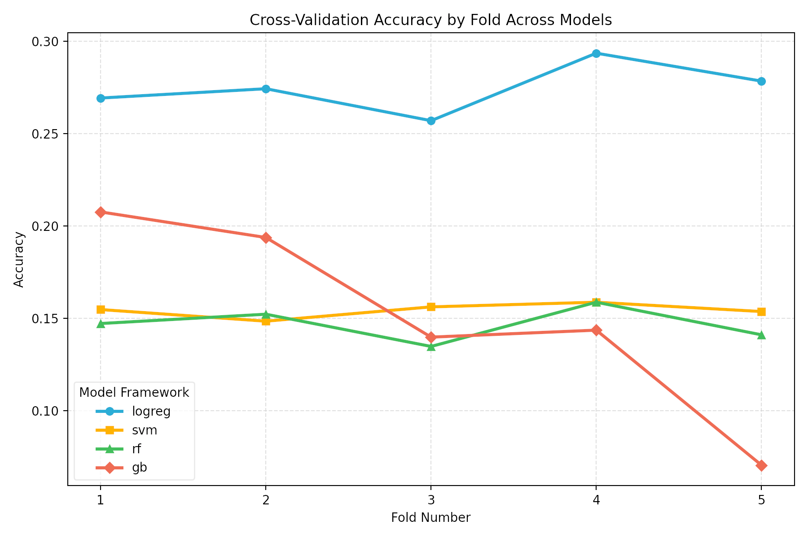
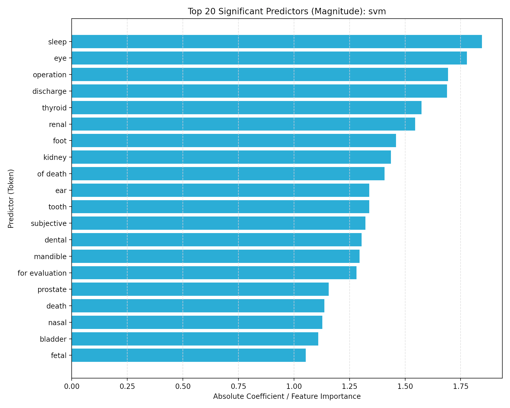

# Medical Transcription Specialty Classification: Model Evaluation Report

## Abstract
Medical data is extremely hard to find due to HIPAA privacy regulations. This dataset offers a solution by providing medical transcription samples. This project classifies medical specialties based on the transcription text. Classical text classification baselines and a transformer baseline are evaluated. Support Vector Machine (SVM) achieved the highest cross-validation macro-F1 score of 0.120294. Logistic regression achieved the highest accuracy of 0.274422.

## Introduction
Clinical narrative text contains specialty-specific language. Predicting specialty labels supports routing, curation, and analytics. The primary challenge is multi-class classification with overlapping terms and class imbalance. The objective is to accurately predict the specialty label given a clinical note text. 

## Methods
The dataset contains 2,377 unique sample names and 2,358 unique transcriptions. The keywords feature contains 21% null values and 2% empty values. The pipeline splits the data into training, validation, and test sets. The classical models trained include logistic regression, SVM, random forest, and gradient boosting. The classical baseline evaluation utilizes 5-fold cross-validation. The transformer baseline utilizes DistilBERT fine-tuning.

## Results
The target variable distribution is heavily skewed. Surgery constitutes 22% of the dataset, and consultations make up 10%. The remaining 68% falls into other categories. Table 1 displays the frequency counts for a subset of these specialties.

### Table 1: Medical Specialty Frequencies (Excerpt)
| Specialty | Count |
| :--- | :--- |
| Radiology | 218 |
| General Medicine | 207 |
| Gastroenterology | 179 |
| Neurology | 178 |
| SOAP / Chart / Progress Notes | 133 |
| Urology | 125 |

The project reports accuracy and class-balanced macro-F1 metrics. Table 2 presents the combined leaderboard for the 5-fold cross-validation means. 

### Table 2: Model Performance Leaderboard
| Model | Split | Accuracy | Macro-F1 | Source |
| :--- | :--- | :--- | :--- | :--- |
| **svm** | cv5_mean | 0.154332 | 0.120294 | classical_cv |
| **rf** | cv5_mean | 0.146776 | 0.065472 | classical_cv |
| **logreg** | cv5_mean | 0.274422 | 0.063190 | classical_cv |
| **gb** | cv5_mean | 0.151032 | 0.040418 | classical_cv |

![Cross Validation Accuracy by Fold Across Models]

Logistic regression maintains the highest accuracy across all five folds, ranging between 0.25 and 0.29. Gradient boosting accuracy drops sharply at fold five. SVM and random forest maintain stable accuracy trajectories near 0.15.

The SVM model relies heavily on specific clinical tokens to form its decision boundaries. The top five predictive tokens by absolute magnitude are "sleep", "eye", "operation", "discharge", and "thyroid".

## Conclusion
Logistic regression achieves the highest cross-validation accuracy. SVM achieves the highest macro-F1 score. High accuracy is largely driven by frequent classes due to long-tail label distributions. Therefore, macro-F1 serves as a more diagnostic metric for this classification task. 

## Limitations
Class imbalance limits macro-F1 performance across classical baselines. Test metrics are currently `NaN` in the combined table because they have not yet been consolidated. Furthermore, DistilBERT training did not complete before patching Transformers v5 API changes.